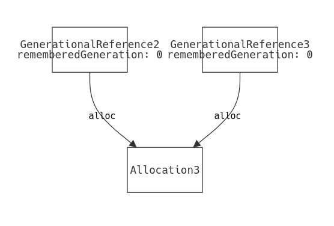

# Memory Safety Guarantees of Generational References modeled in Forge

This project models Generational References (GR), a memory management
technique designed to ensure memory safety without the overhead of garbage
collection or the complexity of ownership systems like Rust's borrow checker.
The implementation of GR in this project is modeled is from the article [Vale's
Memory Safety Strategy: Generational References and Regions](https://verdagon.dev/blog/generational-references)
by Evan Ovadia, author of the [Vale](https://vale.dev/) programming language
which uses GR to achive memory safety. 

GR addresses critical memory safety issues like use-after-free and double-free
errors by attaching a generation counter to each memory allocation. When a
reference is created, it remembers the current generation of its allocation.
Before any dereference, the system checks if the reference's remembered
generation matches the allocation's current generation. This prevents accessing
freed or reused memory, as freeing increments the generation counter.

The goal was to formally verify that GR prevents common memory safety bugs, as
its conceptual elegance and ease of implementation, when combined with the
effectiveness it claims, seem too good to be true.

## Model Design and Visualization

The model represents a state-based system where each `State` contains:
- A set of memory allocations
- A set of references to these allocations
- Two mappings for each allocation: its current generation and whether it's in use

The model supports 4 key operations:
1. Creating an alias (a new, identical reference to an existing reference)
2. Allocating new memory and creating a reference to it
3. Allocating "new" memory by reusing an unused allocation and creating a
   reference to it
4. Freeing a reference (marking its allocation as unused and incrementing
   generation)

The last operation, `free`, was not covered in the GR article but remains an
essential operation to model in order to test memory corruption bugs (that
almost always involve `free`-ing references at the wrong time). This lack of
specification caused me to ignore a key property (that reference to be freed
must be safe to be dereferenced in the first place) and was the most
time-consuming bug in this project.

Assertions were written to verify that GR prevents double-free and
use-after-free issues.
As we've done multiple times in-class, this model uses linear (`is linear`)
traces to represent program execution over time. Theoretically the proofs should
still be valid, but enforcing linearity makes visualization and debugging much
easier.

In the Sterling visualizer, after time projecting over `State`, the visualizer
shows nodes that represent allocations and references, where references are
connected to the allocations that they "reference".
A `theme.json` preset is provided to ease understanding.

Unfortunately, the visualizaton can be confusing because nodes that represent
`GenerationalReference` that are created later in time can appear to be
connected. For example, the following is the initial state of a valid instance:

It seems that the initial state contains two references to an allocation.
However, through the Table view we find that this state actually contains **0**
references and allocations, and the shown `GenerationalReference` and
`Allocation` are both created in later states but are still displayed for
unknown reasons.

This is why the Table view became the most convenient and productive format when
debugging. Efforts to write a custom visualization was abandoned because of the
difficulty to take into account projecting over `State`.

## Signatures and Predicates

### Signatures:
- `Bool`: Simple boolean type with `True` and `False` values
- `Allocation`: Represents a memory allocation
- `GenerationalReference`: A reference with a pointer to an allocation and a
   remembered generation
- `State`: Represents system state with sets of allocations and references,
   plus mappings for generations and usage status

### Key Predicates:
- `wellformed`: Ensures the model's basic structural integrity (e.g.
  references point to valid allocations)
- `init`: Sets up a valid initial state. The main goal is to enforce the
  remembered generation of references to be lower than or equal to the current
  generation of allocations. `init` is effectively the "base case" for this
  invariant. The inductive steps are enforced by the 4 memory operation
  predicates.
- `safeReference`: The core safety check that ensures a reference's remembered
  generation matches its allocation's current generation. When a reference
  doesn't satisfy `safeReference`, this means dereferencing it might cause
  memory corruption.
- Predicates that represent our 4 memory operations:
  - `aliasReference`: Creates a duplicate reference to an existing allocation
  - `allocateNewReference`: Creates a new allocation and reference
  - `allocateReuseReference`: Reuses a freed allocation with an incremented
    generation
  - `freeReference`: Marks an allocation as unused and increments its generation
- `nextState`: Connects states through valid operations
- `traces`: Builds valid execution sequences
- Unsafe patterns (for testing `unsat`):
  - `doubleFree`: Attempts to free the same reference twice
  - `useAfterFree`: Attempts to use a reference after its allocation is freed
  - `useAliasAfterFree`: Attempts to use an alias after the original reference
    is freed

## Testing

The model was tested through a combination of satisfiability and
unsatisfiability checks:

1. **Basic model validation**:
   - `assert traces is sat for exactly 3 State for {next is linear}`: Verifies
     that valid execution traces exist with 3 states
   - `assert traces is sat for exactly 4 State for {next is linear}`: Extends
     validation to 4 states

2. **Safety property verification**:
   - `assert doubleFree is unsat for {next is linear}`: Proves double-free is
     impossible
   - `assert useAfterFree is unsat for {next is linear}`: Proves use-after-free
     is impossible
   - `assert useAliasAfterFree is unsat for {next is linear}`: Proves using an
     alias after freeing is impossible

These tests formally verify that the Generational References technique
successfully prevents the common memory safety issues it claims to address.
