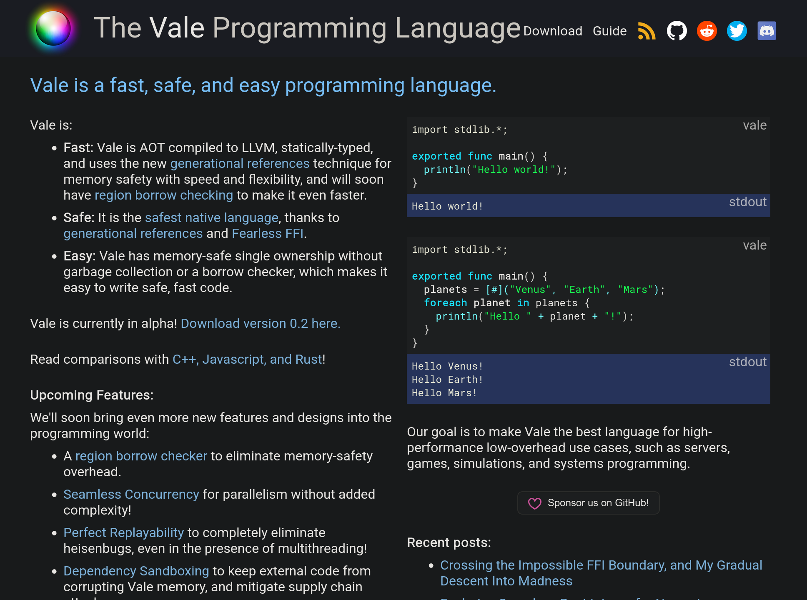

---
# You can also start simply with 'default'
theme: seriph
# random image from a curated Unsplash collection by Anthony
# like them? see https://unsplash.com/collections/94734566/slidev
# background: https://cover.sli.dev
# some information about your slides (markdown enabled)
title: Safety Guarantees and Optimizations of Generational References
info: |
  Proving the safety guarantees and optimizations of Generational References, an
  simple yet elegant memory management technique.

  Final project for Brown CSCI 1710.

  Powered by Slidev. Learn more at [Sli.dev](https://sli.dev)
# apply unocss classes to the current slide
class: text-center
# https://sli.dev/features/drawing
drawings:
  persist: false
# slide transition: https://sli.dev/guide/animations.html#slide-transitions
transition: slide-left
# enable MDC Syntax: https://sli.dev/features/mdc
mdc: true
# open graph
# seoMeta:
#  ogImage: https://cover.sli.dev
---

# Safety Guarantees and Optimizations of Generational References

Authors: Gavin Zhao

CSCI1710 Final Project

<!-- <div @click="$slidev.nav.next" class="mt-12 py-1" hover:bg="white op-10"> -->
<!--   Press Space for next page <carbon:arrow-right /> -->
<!-- </div> -->
<!---->
<!-- <div class="abs-br m-6 text-xl"> -->
<!--   <button @click="$slidev.nav.openInEditor()" title="Open in Editor" class="slidev-icon-btn"> -->
<!--     <carbon:edit /> -->
<!--   </button> -->
<!--   <a href="https://github.com/slidevjs/slidev" target="_blank" class="slidev-icon-btn"> -->
<!--     <carbon:logo-github /> -->
<!--   </a> -->
<!-- </div> -->

<!--
The last comment block of each slide will be treated as slide notes. It will be visible and editable in Presenter Mode along with the slide. [Read more in the docs](https://sli.dev/guide/syntax.html#notes)
-->

---

# Generational References

- Memory management technique that guarantees memory safety.
- Term coined by Evan Ovadia for the Vale programming language.



<!--
You can have `style` tag in markdown to override the style for the current page.
Learn more: https://sli.dev/features/slide-scope-style
-->

<style>
h1 {
  background-color: #2B90B6;
  background-image: linear-gradient(45deg, #4EC5D4 10%, #146b8c 20%);
  background-size: 100%;
  -webkit-background-clip: text;
  -moz-background-clip: text;
  -webkit-text-fill-color: transparent;
  -moz-text-fill-color: transparent;
}
</style>

<!--
Here is another comment.
-->

---

# Memory Safety

After you free a variable, you can't use it again!

<v-click>
In C, if you do use it again, it's UB. In GR, it's guaranteed to crash.
</v-click>
<v-click>Why the heck would I want that?</v-click>

<p>
<v-click>
Allows flexibility: GR can be the bottom most layer. You can add GC, RC, borrow
checker, whatever floats your goat.


</v-click>
</p>

---

# How GR Works

<!-- ::left:: -->

````md magic-move
```c
struct Allocation {
  bool currentlyInUse;
  char allocationBytes[];
};
```
```c {3}
struct Allocation {
  bool currentlyInUse;
  uint64_t currentGeneration;
  char allocationBytes[];
};
```
```c
struct Allocation {
  bool currentlyInUse;
  uint64_t currentGeneration;
  char allocationBytes[];
};

struct GenerationalReference {
  void* alloc;
  uint64_t rememberedGeneration;
};
```
```c
struct Allocation {
  bool currentlyInUse;
  uint64_t currentGeneration;
  char allocationBytes[];
};

struct GenerationalReference {
  void* alloc;
  uint64_t rememberedGeneration;
};

GenerationalReference gmalloc(int size) {
  // Find an Allocation not currentlyInUse.
  // Increment its currentGeneration.
  // Return it.
}
```
```c {|all|20}
struct Allocation {
  bool currentlyInUse;
  uint64_t currentGeneration;
  char allocationBytes[];
};

struct GenerationalReference {
  void* alloc;
  uint64_t rememberedGeneration;
};

GenerationalReference gmalloc(int size) {
  // Find an Allocation not currentlyInUse.
  // Increment its currentGeneration.
  // Return it.
}

void __check(GenerationalReference genRef) {
  uint64_t currentGeneration = *(uint64_t*)((char*)genRef.alloc - 8);
  assert(genRef.rememberedGeneration == currentGeneration);
}
```
````

---

# How GR Works

````md magic-move
```c
void __check(GenerationalReference genRef) {
  uint64_t currentGeneration = *(uint64_t*)((char*)genRef.alloc - 8);
  assert(genRef.rememberedGeneration == currentGeneration);
}

struct Spaceship {
  int numWings;
};

int main() {
  Spaceship* ship = (Spaceship*)malloc(sizeof(Spaceship));

  // Set ship's numWings to 2
  ship->numWings = 2;
}
```
```c
void __check(GenerationalReference genRef) {
  uint64_t currentGeneration = *(uint64_t*)((char*)genRef.alloc - 8);
  assert(genRef.rememberedGeneration == currentGeneration);
}

struct Spaceship {
  int numWings;
};

int main() {
  GenerationalReference shipRef = gmalloc(sizeof(Spaceship));

  // Set ship's numWings to 2
  __check(shipRef);
  ((Ship*)shipRef.alloc)->numWings = 2;
}
```
````

---

# How GR Works

```c {3}
void __check(GenerationalReference genRef) {
  uint64_t currentGeneration = *(uint64_t*)((char*)genRef.alloc - 8);
  assert(genRef.rememberedGeneration == currentGeneration);
}
```

<v-click>
It's as if we're saying:

> "Hello! I'm looking for the 11th inhabitant of this house, are they still around?"

```c
// shipRef.rememberedGeneration = 11
__check(shipRef);
```
</v-click>

<v-click>
and the person who opens the door says:

> "No, sorry, I'm the 12th inhabitant of this house, the 11th inhabitant is no more."
```c
// shipRef.alloc.currentGeneration = 12
```
</v-click>

<v-click>
or instead:

> "Yes! That is me. Feel free to dereference!"
```c
// shipRef.alloc.currentGeneration = 11
```
</v-click>

---

# The Magical Part

Evan claimed

> If we always call `__check` before dereferencing, then our code will be memory-safe.

<v-click>

Sounds too good to be true! We should verify it!

</v-click>

---

# Core Sigs

```{1-14|18|19|20|21|all}
sig Allocation {}

sig GenerationalReference {
  alloc: one Allocation,
  rememberedGeneration: one Int
}

sig State {
  allocations: set Allocation,
  references: set GenerationalReference,
  currentGeneration: pfunc Allocation -> Int,
  currentlyInUse: pfunc Allocation -> Bool,
  next: lone State
}

pred nextState[s1, s2 : State] {
  some r : GenerationalReference | {
    aliasReference[r, s1, s2] or
    allocateNew[r, s1, s2] or
    allocateReuse[r, s1, s2] or
    freeReference[r, s1, s2]
  }
}
```

---

# Verification

<v-click>

Our proof of this statement is
```
pred useAfterFree {
  traces

  some s1, s2 : State, r : GenerationalReference | {
    reachable[s2, s1, next]

    // `r` is freed (implies `r` is safe to be dereferenced)
    freeReference[r, s1, s1.next]
    // now try to reference `r` again
    safeReference[r, s2]
  }
}

// Dereferencing a reference after it's freed is a run-time error
noUseAfterFreeInGr: assert useAfterFree is unsat for {next is linear}
```

</v-click>
---

# Use as Much (Or as Little) GR as You Need

If you want to opt-out of GR, there's only one thing you need to do: don't
call `__check` before de-referencing.

<v-click>
<p>
What this means is that you can stack more memory management techniques like RC,
borrow checker on top of GR. Everything will still work!
</p>
</v-click>

<v-click>
<p>
Let's do this!
Consider one thing that GR doesn't do for us: freeing memory
automagically!
</p>

````md magic-move
```rust 
struct Ship { fuel: i32, }
fn main() {
    let ship = Ship { fuel: 7 };
    __check(ship);
    println!("Ship fuel: {}", ship.fuel);
}
```
```rust
struct Ship { fuel: i32, }
fn main() {
    let ship = Ship { fuel: 7 };
    __check(ship);
    println!("Ship fuel: {}", ship.fuel);
    // `ship` is freed automatically at the end of its scope!
}
```
````
</v-click>

<v-click>

Note that we would also need a check when accessing `fuel`, because `ship`
points to a memory location on the stack.

</v-click>

<v-click>

We would also like to get rid of the `__check(ship)`, because it's really
obvious that it's safe to dereference it.

</v-click>

---

# Extension: Single Ownership

> Every \[Vale] object is owned by a single struct, array, or stack frame. 

<v-click>

So what we would really hope to do is

````md magic-move
```rust
struct Ship { fuel: i32, }
fn main() {
    let ship = Ship { fuel: 7 };
    __check(ship);
    println!("Ship fuel: {}", ship.fuel);
}
```
```rust
struct Ship { fuel: i32, }
fn main() {
    let ship = Ship { fuel: 7 };
    // Doesn't need a __check! 
    // __check(ship);
    println!("Ship fuel: {}", ship.fuel);
}
```
```rust
struct Ship { fuel: i32, }
fn main() {
    let ship = Ship { fuel: 7 };
    // Doesn't need a __check! 
    // __check(ship);
    println!("Ship fuel: {}", ship.fuel);
    free(ship); // Inserted automatically
}
```
````
</v-click>

<v-click>

Here, the owner of `ship` is the stack frame of the `main` function.

</v-click>

<v-click>

When the owner is not-alive, either freed or out-of-scope, all the allocations
it owns must be freed.

</v-click>

<v-click>

Claim:

> If the owner is still alive, dereferencing doesn't need a `__check`!

</v-click>

<!--
The inserting `free` part is usually done by the compiler implementation and is
not part of GR's business. It's just a showcase of how we can extend GR
effortless and without worrying something might break.

What is concerning is that we removed a `__check(ship)`! The entire memory
safety guarantee of GR relies on this! Can we prove that it's always safe to
ignore the checks?
!-->

---

# Adapting Our Model

`State` is changed to store ownership.

````md magic-move
```
sig Allocation {}

sig GenerationalReference {
  alloc: one Allocation,
  rememberedGeneration: one Int
}

sig State {
  allocations: set Allocation,
  references: set GenerationalReference,
  currentGeneration: pfunc Allocation -> Int,
  currentlyInUse: pfunc Allocation -> Bool,
  next: lone State
}
```
```
sig Owner {}

sig Allocation {}

sig GenerationalReference {
  alloc: one Allocation,
  rememberedGeneration: one Int
}

sig State {
  allocations: set Allocation,
  references: set GenerationalReference,
  currentGeneration: pfunc Allocation -> Int,
  currentlyInUse: pfunc Allocation -> Bool,
  next: lone State
}
```
```{17-18|all}
sig Owner {}

sig Allocation {}

sig GenerationalReference {
  alloc: one Allocation,
  rememberedGeneration: one Int
}

sig State {
  allocations: set Allocation,
  references: set GenerationalReference,
  currentGeneration: pfunc Allocation -> Int,
  currentlyInUse: pfunc Allocation -> Bool,
  next: lone State

  ownedBy: pfunc Allocation -> Owner,
  liveOwners: set Owner
}
```
````

---

# Adapting Our Model

All of our operations needs modifications.

````md magic-move
```
pred nextState[s1, s2 : State] {
  some r : GenerationalReference | {
    aliasReference[r, s1, s2] or
    allocateNew[r, s1, s2] or
    allocateReuse[r, s1, s2] or
    freeReference[r, s1, s2]
  }
}
```
```
pred nextState[s1, s2 : State] {
  some r : GenerationalReference, o : Owner | {
    aliasReference[r, s1, s2] or
    allocateNew[r, s1, s2] or
    allocateReuse[r, s1, s2] or
    freeReference[r, s1, s2]
  }
}
```
```{4-5}
pred nextState[s1, s2 : State] {
  some r : GenerationalReference, o : Owner | {
    aliasReference[r, s1, s2] or
    allocateNew[r, o, s1, s2] or
    allocateReuse[r, o, s1, s2] or
    freeReference[r, s1, s2]
  }
}
```
```{6}
pred nextState[s1, s2 : State] {
  some r : GenerationalReference, o : Owner | {
    aliasReference[r, s1, s2] or
    allocateNew[r, o, s1, s2] or
    allocateReuse[r, o, s1, s2] or
    freeOwner[o, s1, s2]
  }
}
```
```{6|all}
pred nextState[s1, s2 : State] {
  some r : GenerationalReference, o : Owner | {
    aliasReference[r, s1, s2] or
    allocateNew[r, o, s1, s2] or
    allocateReuse[r, o, s1, s2] or
    newOwner[o, s1, s2]
    freeOwner[o, s1, s2]
  }
}
```
````

---

# Proof of Optimization Safety

````md magic-move
```{all|5-12|14|16|all}
pred liveOwnerIsNotSafe {
  traces

  some s0, s : State, r : GenerationalReference, o : Owner | {
    reachable[s, s0, next]

    // Handle the case that `r` is an alias.
    some r0 : GenerationalReference | {
      r.alloc = r0.alloc
      r.rememberedGeneration = r0.rememberedGeneration
      (allocateNew[r0, o, s0, s0.next] or allocateReuse[r0, o, s0, s0.next])
    }

    o in s.liveOwners

    not safeReference[r, s]
  }
}
```
```
pred liveOwnerIsNotSafe {
  traces

  some s0, s : State, r : GenerationalReference, o : Owner | {
    reachable[s, s0, next]

    // Handle the case that `r` is an alias.
    some r0 : GenerationalReference | {
      r.alloc = r0.alloc
      r.rememberedGeneration = r0.rememberedGeneration
      (allocateNew[r0, o, s0, s0.next] or allocateReuse[r0, o, s0, s0.next])
    }

    o in s.liveOwners

    not safeReference[r, s]
  }
}

liveOwnerAlwaysSafe: assert liveOwnerIsNotSafe is unsat for {next is linear}
```
````

<v-click>

That's all the proofs!

</v-click>

---

# Why Not Temporal Forge

I can't travel forward in time :(

````md magic-move
```
pred allocateNew[r : GenerationalReference] {
    r.alloc not in Allocation
    r.alloc in Allocation'

    // ... other constraints
}
```
```{all|10-13|2|all}
pred allocateNew[r : GenerationalReference] {
    r.alloc not in Allocation
    r.alloc in Allocation'

    // ... other constraints
}

hasGrTraceWithEmptyOwnerOwnsAlloc: assert {
	traces
	some s : State, o : Owner, r : GenerationalReference {
		newOwner[o, s, s.next]
		allocateNew[r, o, s.next, s.next.next]
	}
} is sat for 3 State for {next is linear}
```
````

<v-click at='-2'>

I want a handle to something that will be created in the future!

</v-click>

<v-click at='+2'>

The whole point of using Temporal Forge is so that the set of instances of t hat
type represent all the memory objects that are still alive. If I can't do this,
it defeats the purpose of using Temporal Forge in the first place.

</v-click>

---

# Very Messy and Misleading Visualization

We'll see!

---
layout: center
---

# Thank you
<PoweredBySlidev mt-10 />
